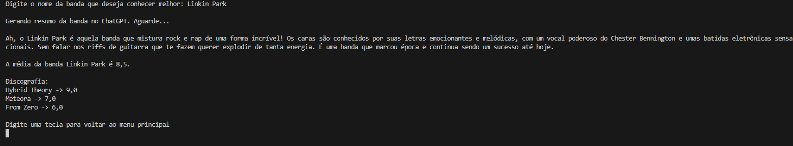

# Screen Sound - Console 🎵

```
░██████╗░█████╗░██████╗░███████╗███████╗███╗░░██╗  ░██████╗░█████╗░██╗░░░██╗███╗░░██╗██████╗░
██╔════╝██╔══██╗██╔══██╗██╔════╝██╔════╝████╗░██║  ██╔════╝██╔══██╗██║░░░██║████╗░██║██╔══██╗
╚█████╗░██║░░╚═╝██████╔╝█████╗░░█████╗░░██╔██╗██║  ╚█████╗░██║░░██║██║░░░██║██╔██╗██║██║░░██║
░╚═══██╗██║░░██╗██╔══██╗██╔══╝░░██╔══╝░░██║╚████║  ░╚═══██╗██║░░██║██║░░░██║██║╚████║██║░░██║
██████╔╝╚█████╔╝██║░░██║███████╗███████╗██║░╚███║  ██████╔╝╚█████╔╝╚██████╔╝██║░╚███║██████╔╝
╚═════╝░░╚════╝░╚═╝░░╚═╝╚══════╝╚══════╝╚═╝░░╚══╝  ╚═════╝░░╚════╝░░╚═════╝░╚═╝░░╚══╝╚═════╝░
```

## 📄 Descrição

**Screen Sound** é uma aplicação de console desenvolvida em C# para gerenciar e avaliar bandas de música. O projeto permite registrar bandas, álbuns e dar notas, além de contar com uma integração com a **API da OpenAI** para gerar resumos inteligentes e personalizados sobre as bandas registradas.

Este projeto foi construído como parte dos estudos da Formação C# da Alura, com o objetivo de praticar conceitos de Orientação a Objetos, consumo de APIs e boas práticas de desenvolvimento em .NET.

## ✨ Funcionalidades Principais

-   **Registro de Bandas e Álbuns:** Adicione novas bandas e seus álbuns ao sistema.
-   **Avaliação:** Atribua notas de 0 a 10 para suas bandas e álbuns favoritos.
-   **Visualização de Detalhes:** Exiba a média de notas de uma banda, sua discografia e um resumo exclusivo.
-   **Integração com IA:** Ao solicitar os detalhes de uma banda, o sistema consulta a API da OpenAI para gerar uma descrição rica e informativa sobre ela.

## 🛠️ Tecnologias Utilizadas

-   **C#:** Linguagem principal do projeto.
-   **.NET 8:** A mais recente plataforma de desenvolvimento da Microsoft.
-   **Betalgo.OpenAI:** Biblioteca para integração com a API da OpenAI.
-   **.NET User Secrets:** Ferramenta para armazenamento seguro de chaves de API em ambiente de desenvolvimento.

## ⚙️ Pré-requisitos

Antes de começar, você vai precisar ter instalado em sua máquina:
-   [.NET 8 SDK](https://dotnet.microsoft.com/download/dotnet/8.0)
-   Uma chave de API válida da [OpenAI](https://platform.openai.com/)

## 🚀 Como Rodar o Projeto

1.  **Clone o repositório:**
    ```bash
    git clone [https://github.com/SEU-USUARIO/SEU-REPOSITORIO.git](https://github.com/SEU-USUARIO/SEU-REPOSITORIO.git)
    ```

2.  **Navegue até a pasta do projeto:**
    ```bash
    cd screen-sound-v3
    ```

3.  **Configure sua chave da OpenAI:**
    O projeto utiliza o .NET User Secrets para proteger sua chave de API. Execute o comando abaixo, substituindo `"SUA_CHAVE_VAI_AQUI"` pela sua chave:
    ```bash
    dotnet user-secrets set "OpenAI_ApiKey" "SUA_CHAVE_VAI_AQUI"
    ```

4.  **Restaure as dependências:**
    ```bash
    dotnet restore
    ```

5.  **Execute a aplicação:**
    ```bash
    dotnet run
    ```

## 📸 Screenshot

Veja a aplicação em ação, exibindo o resumo gerado pela IA para a banda:


---
Feito por João Pedro Rosa :D